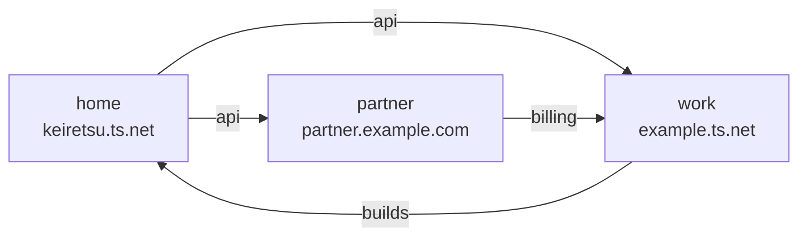
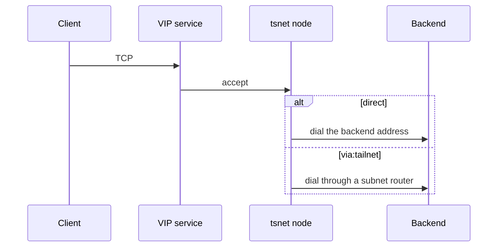

# tailnetlink

tailnetlink forwards TCP between Tailscale networks. A **tailnet** is one Tailscale network. A **tsnet node** is a Tailscale node that this process runs in userspace. A **VIP service** is a name and address in a tailnet that other nodes dial. A **bridge** forwards TCP from VIP services in one tailnet to hosts in another. A **border** is a config with one source tailnet and one or more destination tailnets. **Split DNS** sends lookups for a chosen name to a DNS server this process runs. One process joins each tailnet in the file with one tsnet node. That node dials for every bridge that leaves the tailnet, and it hosts the VIP services for every bridge that arrives.

## Shared nodes

Three tailnets. One node in each. `home` fans out to `work` and `partner`. `work` bridges back to `home`. `partner` bridges to `work`.



## One connection

A client dials a VIP service. The destination tsnet node accepts the TCP connection. It then dials the backend. A direct dial uses the discovered address, or the host network when a local entry leaves `via` unset. `via` set to `tailnet` dials through a subnet router in the source tailnet.



## How it works

1. The process reads one JSON file. It checks the file every 3 seconds and applies an edit when the modification time moves.
2. It starts one tsnet node for each tailnet key. The hostname is `tailnetlink-<key>`. A border uses `tailnetlink-<name>-src` for the source and `tailnetlink-<name>-dst` for one `dest`. Each entry in `dests` uses `tailnetlink-<name>-dst-` plus four hex characters of a hash of the lowercased tailnet name.
3. The first start mints an auth key. A later start reuses the node state on disk, so the node keeps its identity.
4. Links that leave one tailnet share one device list and one service list. When every such link selects by tag, that device list asks for those tags. The first poll waits a random time of at most 5 seconds, and at most one fifth of the poll interval. Later polls vary by up to one fifth of the interval.
5. Each destination of a link has its own reconcile queue with 8 workers. A failed poll leaves the desired set unchanged. A name leaves the set after it has been missing for 3 polls or 2 minutes. One poll deletes at most 50 names.
6. Every VIP service this process creates carries `tailnetlink/owner` and `tailnetlink/managed`. A bridge also writes `tailnetlink/bridge=<from>/<dest>/<link>`, using the node keys and the link name. The process updates a service when the owner matches and the bridge annotation is empty or equal. Tag discovery skips a service marked `tailnetlink/managed=true` and a device whose hostname starts with `tailnetlink-`. A reverse bridge leaves those names out of the next export.
7. The destination node listens on the VIP. Listens on one node run one at a time. A listen counts after the service appears in that node's advertised set. The forwarder reads the PROXY header, checks authorization, and dials the backend for that port.
8. A tag, device, or service link dials the discovered address through the source tsnet node. A local entry dials the host network when `via` is unset or `pod`. `"via": "tailnet"` dials through that same node. The node installs only the most specific advertised subnet prefix that covers the address, and the prefix that covers a split-DNS nameserver used to resolve a name. `RouteAll` stays off. The process runs the node in userspace. It starts no sidecar and opens no TUN device.
9. With DNS on, the process serves DNS over TCP on a shared VIP and registers split DNS in the destination tailnet.

## Quick start

Save this file as `tailnetlink.json`. Set each client id, and the file or variable that holds the secret. Then run:

```bash
go run ./cmd/tailnetlink -data tailnetlink.json
```

The web UI listens on `http://127.0.0.1:8888`. Health and metrics listen on `http://127.0.0.1:9090/healthz`.

The file joins two tailnets and bridges one tagged service from `home` to `work`.

```json
{
  "name": "home-work",
  "tailnets": {
    "home": {
      "tailnet": "keiretsu.ts.net",
      "oauth": {"client_id": "home-client", "client_secret_file": "/run/secrets/home"},
      "tags": ["tag:tailnetlink"]
    },
    "work": {
      "tailnet": "example.ts.net",
      "oauth": {"client_id": "work-client", "client_secret_env": "TAILNETLINK_WORK_SECRET"},
      "tags": ["tag:tailnetlink"]
    }
  },
  "bridges": [
    {
      "from": "home",
      "to": ["work"],
      "links": [
        {"name": "api", "tag": "tag:api-server", "ports": [8080]}
      ]
    }
  ]
}
```

`make dev` runs the same binary with debug logs. See [CONTRIBUTING.md](CONTRIBUTING.md) for tests.

## Two config shapes

Use **tailnets and bridges** when one process joins every tailnet and bridges run in more than one direction. The picture above is this shape. `from` is a tailnet key. `to` is a list of other keys. One bridge can list several destinations, which is the fan-out from `home`.

```json
{
  "name": "mesh",
  "tailnets": {
    "home": {
      "tailnet": "keiretsu.ts.net",
      "oauth": {"client_id": "home-client", "client_secret_file": "/run/secrets/home"},
      "tags": ["tag:tailnetlink"]
    },
    "work": {
      "tailnet": "example.ts.net",
      "oauth": {"client_id": "work-client", "client_secret_env": "TAILNETLINK_WORK_SECRET"},
      "tags": ["tag:tailnetlink"]
    },
    "partner": {
      "tailnet": "partner.example.com",
      "oauth": {"client_id": "partner-client", "client_secret_file": "/run/secrets/partner"},
      "tags": ["tag:tailnetlink"],
      "dns": {"enabled": false}
    }
  },
  "bridges": [
    {
      "from": "home",
      "to": ["work", "partner"],
      "links": [{"name": "api", "tag": "tag:api-server", "ports": [8080, 8443]}]
    },
    {
      "from": "work",
      "to": ["home"],
      "links": [{"name": "builds", "tag": "tag:build-runner", "ports": [22, 443]}]
    },
    {
      "from": "partner",
      "to": ["work"],
      "links": [{"name": "billing", "services": [{"name": "svc:billing"}], "ports": [443]}]
    }
  ]
}
```

Use **source and dest** when one source tailnet publishes the same links into one destination. Use **source and dests** when that source publishes into several destinations and each destination keeps its own node, DNS, and authz. A full `dests` file is in [docs/configuration.md](docs/configuration.md).

```json
{
  "name": "home-to-work",
  "source": {
    "tailnet": "keiretsu.ts.net",
    "oauth": {"client_id": "home-client", "client_secret_file": "/run/secrets/home"},
    "tags": ["tag:tailnetlink"]
  },
  "dest": {
    "tailnet": "example.ts.net",
    "oauth": {"client_id": "work-client", "client_secret_env": "TAILNETLINK_WORK_SECRET"},
    "tags": ["tag:tailnetlink"]
  },
  "links": [
    {"name": "api", "tag": "tag:api-server", "ports": [8080, 8443]}
  ]
}
```

A mesh and a border stay in separate files. `links` may be `[]` on a border. The nodes still join. An empty `bridges` list is allowed on a mesh.

## Expose a tagged service

Give the link a `tag` and the TCP `ports` to forward. The source poll lists devices and VIP services that carry that tag. Each match becomes a VIP service in every destination of the bridge.

The quick start above does this for `tag:api-server` on port 8080. The mesh example adds `8443` on the same link.

`devices` names source nodes by FQDN. `services` names source VIP services, as `billing` does in the mesh example. A link sets one of `tag`, `devices`, `services`, or `local`.

## Expose a local address or a subnet route

A `local` entry is one VIP service. `addr` as `host:port` dials that address on the host network. An IP or `localhost` needs `dns_name`.

Set `"via": "tailnet"` to dial through the tsnet node of the tailnet the bridge leaves. A hostname resolves with that tailnet's MagicDNS and split DNS. An IP such as `10.20.0.10` is dialed the same way. The node installs the most specific advertised prefix that covers the address. The source tailnet policy still grants this node's tag access to that address. A missing prefix increments `tailnetlink_routed_dial_failures_total` with `reason="no_route"`. A filtered or timed-out dial uses `reason="denied"`.

```json
{
  "name": "home-work",
  "tailnets": {
    "home": {
      "tailnet": "keiretsu.ts.net",
      "oauth": {"client_id": "home-client", "client_secret_file": "/run/secrets/home"},
      "tags": ["tag:tailnetlink"]
    },
    "work": {
      "tailnet": "example.ts.net",
      "oauth": {"client_id": "work-client", "client_secret_env": "TAILNETLINK_WORK_SECRET"},
      "tags": ["tag:tailnetlink"]
    }
  },
  "bridges": [
    {
      "from": "home",
      "to": ["work"],
      "links": [
        {
          "name": "apps",
          "local": [
            {
              "addr": "127.0.0.1:3000",
              "expose_port": 80,
              "dns_name": "app.example.com",
              "short_name": "app"
            },
            {
              "addr": "10.20.0.10",
              "via": "tailnet",
              "dns_name": "db.example.com",
              "short_name": "db",
              "ports": [5432]
            }
          ]
        }
      ]
    }
  ]
}
```

`app` is dialed on the host network at `127.0.0.1:3000` and published on VIP port 80. `db` is dialed through `home` at `10.20.0.10:5432`.

## Several ports on one VIP

Give `addr` as a host with no port, and set `ports`. A list exposes each port and dials the same port. An object maps the VIP port to a different backend port. One entry is still one VIP service.

```json
{
  "name": "home-work",
  "tailnets": {
    "home": {
      "tailnet": "keiretsu.ts.net",
      "oauth": {"client_id": "home-client", "client_secret_file": "/run/secrets/home"},
      "tags": ["tag:tailnetlink"]
    },
    "work": {
      "tailnet": "example.ts.net",
      "oauth": {"client_id": "work-client", "client_secret_env": "TAILNETLINK_WORK_SECRET"},
      "tags": ["tag:tailnetlink"]
    }
  },
  "bridges": [
    {
      "from": "home",
      "to": ["work"],
      "links": [
        {
          "name": "web",
          "local": [
            {
              "addr": "10.0.0.1",
              "dns_name": "app.example.com",
              "short_name": "app",
              "ports": [80, 443]
            },
            {
              "addr": "10.0.0.2",
              "dns_name": "admin.example.com",
              "short_name": "admin",
              "ports": {"80": 8080, "443": 8443}
            }
          ]
        }
      ]
    }
  ]
}
```

`svc:app` advertises `tcp:80` and `tcp:443` and dials `10.0.0.1` on those ports. `svc:admin` advertises the same VIP ports and dials `10.0.0.2:8080` and `10.0.0.2:8443`.

## Split DNS for one exact name

With DNS on, a `dns_name` is published in its parent zone. `app.corp.example.com` is the label `app` in the zone `corp.example.com`, so every other name under that zone is also sent to the DNS VIP.

Set `dns_zone` to the same value as `dns_name` to register split DNS for that name only. The record is the apex of that zone.

```json
{
  "name": "home-to-work",
  "source": {
    "tailnet": "keiretsu.ts.net",
    "oauth": {"client_id": "home-client", "client_secret_file": "/run/secrets/home"},
    "tags": ["tag:tailnetlink"]
  },
  "dest": {
    "tailnet": "example.ts.net",
    "oauth": {"client_id": "work-client", "client_secret_env": "TAILNETLINK_WORK_SECRET"},
    "tags": ["tag:tailnetlink"]
  },
  "links": [
    {
      "name": "app",
      "devices": [
        {
          "fqdn": "app.keiretsu.ts.net",
          "dns_name": "app.corp.example.com",
          "dns_zone": "app.corp.example.com"
        }
      ],
      "ports": [443]
    }
  ]
}
```

The DNS server answers over TCP on `svc:tnl-dns-<zone>-dns`. UDP sent to a VIP address is dropped by the node. Clients retry the lookup over TCP.

## Workload identity login

Put the OAuth client id in `client_id`. Put the path of an OIDC JWT in `id_token_file`, or the name of an environment variable in `id_token_env`. The process reads the JWT on each token exchange and posts it to the tailnet's token-exchange endpoint. The API token is cached until it expires. One HTTP 401 is exchanged again.

The credential needs the scopes `devices:core:read`, `auth_keys`, `services`, and `dns`. The `auth_keys` scope includes the tag in `tags`.

```json
{
  "name": "home-work",
  "tailnets": {
    "home": {
      "tailnet": "keiretsu.ts.net",
      "oauth": {"client_id": "home-federated", "id_token_file": "/var/run/tailscale/home-id-token"},
      "tags": ["tag:tailnetlink"]
    },
    "work": {
      "tailnet": "example.ts.net",
      "oauth": {"client_id": "work-federated", "id_token_env": "TAILNETLINK_WORK_ID_TOKEN"},
      "tags": ["tag:tailnetlink"]
    }
  },
  "bridges": [
    {
      "from": "home",
      "to": ["work"],
      "links": [
        {"name": "api", "tag": "tag:api-server", "ports": [8080]}
      ]
    }
  ]
}
```

## Reference

- [docs/configuration.md](docs/configuration.md) — fields, local ports, `via`, authz, OAuth, split DNS
- [docs/operations.md](docs/operations.md) — ownership, restarts, state, CLI, Docker, metrics, the web UI
- [docs/architecture.md](docs/architecture.md) — file layout and the forward path
- [docs/security.md](docs/security.md) — secrets, the UI, ownership, authz
- [docs/testing.md](docs/testing.md) — unit, testcontrol, and real-tailnet tests
- [config.example.json](config.example.json) — one source and one destination
- [config.mesh.example.json](config.mesh.example.json) — three tailnets
- [deploy/](deploy/) — compose example

## License

BSD 3-Clause. See [LICENSE](LICENSE).
