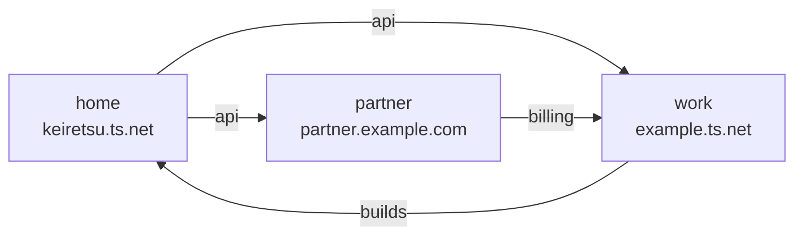
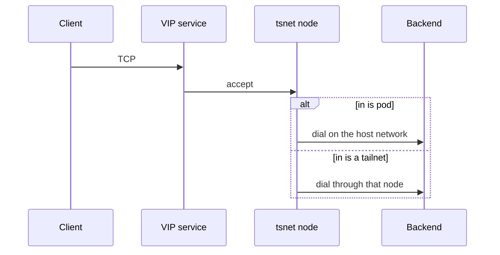

# tailnetlink

tailnetlink forwards TCP between Tailscale networks. A **tailnet** is one Tailscale network. A **tsnet node** is a Tailscale node that this process runs in userspace. A **VIP service** is a name and address in a tailnet that other nodes dial. A **target** is one thing this process can reach: devices with a tag, one device, one VIP service, an IP, or a DNS name. An **export** publishes a target as VIP services in other tailnets. **Split DNS** sends lookups for a chosen name to a DNS server this process runs. One process joins each tailnet that a target or an export names. That node dials for every target in the tailnet, and it hosts the VIP services for every export into the tailnet.

## Shared nodes

Three tailnets. One node in each. The `api` target is in `home` and is exported to `work` and `partner`. `builds` is in `work` and is exported back to `home`. `billing` is in `partner` and is exported to `work`.



## One connection

A client dials a VIP service. The destination tsnet node accepts the TCP connection. It then dials the backend. A target with `in` set to `pod` dials on the host network. A target with `in` set to a tailnet key dials through that tailnet's node. An IP or DNS name on that path uses a subnet router when the address is not on the tailnet itself.



## How it works

1. The process reads one JSON file. It checks the file every 3 seconds and applies an edit when the modification time moves. An edit restarts only the exports that changed.
2. It starts one tsnet node for each tailnet key that a target or an export names. The hostname is `tailnetlink-<key>` unless that tailnet sets `node.hostname`. A tailnet stops when nothing names it.
3. The first start mints an auth key. A later start reuses the node state on disk, so the node keeps its identity.
4. Targets that share one `in` tailnet share one device list and one service list. When every such target selects by tag, that device list asks for those tags. The first poll waits a random time of at most 5 seconds, and at most one fifth of the poll interval. Later polls vary by up to one fifth of the interval.
5. Each destination of an export has its own reconcile queue with 8 workers. A failed poll leaves the desired set unchanged. A name leaves the set after it has been missing for 3 polls or 2 minutes. One poll deletes at most 50 names.
6. Every VIP service this process creates carries `tailnetlink/owner` and `tailnetlink/managed`. An export also writes `tailnetlink/export=<target>/<to>`. The process updates a service when the owner matches and the export annotation is empty or equal. Discovery skips a service marked `tailnetlink/managed=true` and this process's own node. A target in a tailnet therefore leaves those names out of the next export.
7. The destination node listens on the VIP. Listens on one node run one at a time. A listen counts after the service appears in that node's advertised set. The forwarder reads the PROXY header, checks authorization, and dials the backend for that port. A port map dials the backend port for the VIP port the client opened.
8. A tag, device, or service target dials the discovered address through the `in` node. An `addr` or `host` target dials that address. `in` set to `pod` uses the host network and the process resolver. `in` set to a tailnet key uses that node's MagicDNS and split DNS. The node installs only the most specific advertised subnet prefix that covers the address, and the prefix that covers a split-DNS nameserver used to resolve a name. `RouteAll` stays off. The process runs the node in userspace. It starts no sidecar and opens no TUN device.
9. With DNS on for a destination, the process serves DNS over TCP on a shared VIP and registers split DNS in that tailnet.

## Quick start

Save this file as `tailnetlink.json`. Set each client id, and the file or variable that holds the secret. Then run:

```bash
go run ./cmd/tailnetlink -data tailnetlink.json
```

The web UI listens on `http://127.0.0.1:8888`. Health and metrics listen on `http://127.0.0.1:9090/healthz`.

The file joins two tailnets and exports one tagged target from `home` to `work`.

```json
{
  "name": "home-work",
  "tailnets": {
    "home": {
      "tailnet": "keiretsu.ts.net",
      "auth": {"client_id": "home-client", "client_secret_file": "/run/secrets/home"}
    },
    "work": {
      "tailnet": "example.ts.net",
      "auth": {"client_id": "work-client", "client_secret_env": "TAILNETLINK_WORK_SECRET"}
    }
  },
  "targets": {
    "api": {"in": "home", "tag": "tag:api-server", "ports": [8080]}
  },
  "exports": [
    {"target": "api", "to": ["work"]}
  ]
}
```

`make dev` runs the same binary with debug logs. See [CONTRIBUTING.md](CONTRIBUTING.md) for tests.

## Three parts

`tailnets` maps a key to one node and one login. `auth` has `client_id` and exactly one of `client_secret_file`, `client_secret_env`, `id_token_file`, or `id_token_env`. `tags` defaults to `["tag:tailnetlink"]`. The key `pod` is reserved.

`targets` maps a key to what to reach. `in` is a tailnet key or `pod`. A target sets one of `tag`, `device` (a device FQDN), `service` (a name like `svc:billing`), `addr` (an IP), or `host` (a DNS name). `ports` is a list, which dials the same port, or a map from VIP port to backend port. A `pod` target sets `addr` or `host`.

`exports` is a list. Each entry has `target` and `to`, a list of tailnet keys. `to` does not include that target's `in`. `name` defaults to the target key. One target can appear in several exports when the names differ. Two exports that would publish the same name into one tailnet are rejected when the file loads.

A tag target publishes one VIP per device. The name is `<name>-<host>`, cut and hashed so it fits one DNS label. `<host>` is the device hostname, or the service name without `svc:`. A `dns_name` on that export is a template and must contain `{host}`.

A device, service, address, or hostname target publishes one VIP. The name is `name`. An address needs `dns_name` on the export. A hostname uses `dns_name` when it is set, and otherwise uses the hostname.

```json
{
  "name": "three-nets",
  "tailnets": {
    "home": {
      "tailnet": "keiretsu.ts.net",
      "auth": {"client_id": "home-client", "client_secret_file": "/run/secrets/home"}
    },
    "work": {
      "tailnet": "example.ts.net",
      "auth": {"client_id": "work-client", "client_secret_env": "TAILNETLINK_WORK_SECRET"}
    },
    "partner": {
      "tailnet": "partner.example.com",
      "auth": {"client_id": "partner-client", "client_secret_file": "/run/secrets/partner"},
      "dns": false
    }
  },
  "targets": {
    "api": {"in": "home", "tag": "tag:api-server", "ports": [8080, 8443]},
    "builds": {"in": "work", "tag": "tag:build-runner", "ports": [22, 443]},
    "billing": {"in": "partner", "service": "svc:billing", "ports": [443]}
  },
  "exports": [
    {"target": "api", "to": ["work", "partner"], "dns_name": "{host}.api.example.com"},
    {"target": "builds", "to": ["home"]},
    {"target": "billing", "to": ["work"]}
  ]
}
```

`name` is the owner written on every VIP service. It is 1 to 40 lowercase letters, digits, or dashes. A file that still has `source`, `dest`, `dests`, `bridges`, `links`, `via`, or `expose_port` is rejected. There is no converter.

## Expose a tagged service

The quick start exports `tag:api-server` from `home` to `work` on port 8080. The three-tailnet example adds port 8443 and a second destination. Each device becomes a VIP named `api-<host>`.

`device` names one source node by FQDN. `service` names one source VIP service, as `billing` does.

## Expose an address

`addr` is an IP. `host` is a DNS name. `in` chooses the dial path.

```json
{
  "name": "home-work",
  "tailnets": {
    "home": {
      "tailnet": "keiretsu.ts.net",
      "auth": {"client_id": "home-client", "client_secret_file": "/run/secrets/home"}
    },
    "work": {
      "tailnet": "example.ts.net",
      "auth": {"client_id": "work-client", "client_secret_env": "TAILNETLINK_WORK_SECRET"}
    }
  },
  "targets": {
    "app": {"in": "pod", "addr": "127.0.0.1", "ports": {"80": 3000}},
    "db": {"in": "home", "addr": "10.20.0.10", "ports": [5432]}
  },
  "exports": [
    {"target": "app", "to": ["work"], "dns_name": "app.example.com"},
    {"target": "db", "to": ["work"], "dns_name": "db.example.com"}
  ]
}
```

`app` is dialed on the host network at `127.0.0.1:3000` and published on VIP port 80. `db` is dialed through the `home` node at `10.20.0.10:5432`. The `home` node installs the most specific advertised prefix that covers `10.20.0.10`. A missing prefix increments `tailnetlink_routed_dial_failures_total` with `reason="no_route"`. A filtered or timed-out dial uses `reason="denied"`.

## Several ports on one VIP

A list uses the same number on the VIP and on the backend. A map sends VIP port 80 to backend port 8080. One target is still one VIP, or one VIP per device when the target is a tag.

```json
{
  "name": "home-work",
  "tailnets": {
    "home": {
      "tailnet": "keiretsu.ts.net",
      "auth": {"client_id": "home-client", "client_secret_file": "/run/secrets/home"}
    },
    "work": {
      "tailnet": "example.ts.net",
      "auth": {"client_id": "work-client", "client_secret_env": "TAILNETLINK_WORK_SECRET"}
    }
  },
  "targets": {
    "app": {"in": "pod", "addr": "10.0.0.1", "ports": [80, 443]},
    "admin": {"in": "pod", "addr": "10.0.0.2", "ports": {"80": 8080, "443": 8443}}
  },
  "exports": [
    {"target": "app", "to": ["work"], "dns_name": "app.example.com"},
    {"target": "admin", "to": ["work"], "dns_name": "admin.example.com"}
  ]
}
```

`svc:app` advertises `tcp:80` and `tcp:443` and dials `10.0.0.1` on those ports. `svc:admin` advertises the same VIP ports and dials `10.0.0.2:8080` and `10.0.0.2:8443`.

## Split DNS for one exact name

With DNS on, a device FQDN is published in its parent zone. Set `dns_name` and `dns_zone` to the same value to register split DNS for that name only. The record is the apex of that zone.

```json
{
  "name": "home-work",
  "tailnets": {
    "home": {
      "tailnet": "keiretsu.ts.net",
      "auth": {"client_id": "home-client", "client_secret_file": "/run/secrets/home"}
    },
    "work": {
      "tailnet": "example.ts.net",
      "auth": {"client_id": "work-client", "client_secret_env": "TAILNETLINK_WORK_SECRET"}
    }
  },
  "targets": {
    "app": {"in": "home", "device": "app.keiretsu.ts.net", "ports": [443]}
  },
  "exports": [
    {
      "target": "app",
      "to": ["work"],
      "dns_name": "app.corp.example.com",
      "dns_zone": "app.corp.example.com"
    }
  ]
}
```

The DNS server answers over TCP on `svc:tnl-dns-<zone>-dns`. UDP sent to a VIP address is dropped by the node. Clients retry the lookup over TCP.

## Workload identity login

Put the OAuth client id in `client_id`. Put the path of an OIDC JWT in `id_token_file`, or the name of an environment variable in `id_token_env`. The process reads the JWT on each token exchange and posts it to the tailnet's token-exchange endpoint. The API token is cached until it expires. One HTTP 401 is exchanged again.

The credential needs the scopes `devices:core:read`, `auth_keys`, `services`, and `dns`. The `auth_keys` scope includes the tag in `tags`.

```json
{
  "name": "home-work",
  "tailnets": {
    "home": {
      "tailnet": "keiretsu.ts.net",
      "auth": {"client_id": "home-federated", "id_token_file": "/var/run/tailscale/home-id-token"}
    },
    "work": {
      "tailnet": "example.ts.net",
      "auth": {"client_id": "work-federated", "id_token_env": "TAILNETLINK_WORK_ID_TOKEN"}
    }
  },
  "targets": {
    "api": {"in": "home", "tag": "tag:api-server", "ports": [8080]}
  },
  "exports": [
    {"target": "api", "to": ["work"]}
  ]
}
```

## Reference

- [docs/configuration.md](docs/configuration.md) — fields, ports, authz, login, split DNS
- [docs/operations.md](docs/operations.md) — ownership, restarts, state, CLI, Docker, metrics, the web UI
- [docs/architecture.md](docs/architecture.md) — file layout and the forward path
- [docs/security.md](docs/security.md) — secrets, the UI, ownership, authz
- [docs/testing.md](docs/testing.md) — unit, testcontrol, and real-tailnet tests
- [config.example.json](config.example.json) — three tailnets, four targets
- [deploy/](deploy/) — compose example

## License

BSD 3-Clause. See [LICENSE](LICENSE).
